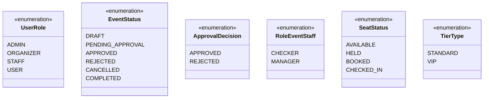

# Class Diagram - Management Service

## Entity Layer Classes

```mermaid
classDiagram
    class User {
        -Long id
        -String fullName
        -String email
        -UserRole role
        -LocalDateTime syncedAt
        -List~Event~ events
        -List~EventApproval~ eventApprovals
        -List~EventStaff~ eventStaff
    }
    
    class Event {
        -Long id
        -User organizer
        -String title
        -String description
        -String venue
        -String city
        -String locationCoords
        -LocalDateTime startTime
        -LocalDateTime endTime
        -String bannerUrl
        -EventStatus status
        -Boolean isPublished
        -LocalDateTime createdAt
        -LocalDateTime updatedAt
        -List~AnalyticsEvent~ analyticsEvents
        -List~EventStaff~ eventStaff
        -List~EventApproval~ eventApprovals
        -List~SeatMap~ seatMaps
    }
    
    class EventApproval {
        -Long id
        -Event event
        -User admin
        -ApprovalDecision decision
        -String reason
        -LocalDateTime decidedAt
    }
    
    class EventStaff {
        -EventStaffId id
        -Event event
        -User staff
        -RoleEventStaff roleInEvent
        -LocalDateTime assignedAt
    }
    
    class EventStaffId {
        -Long eventId
        -Long staffId
    }
    
    class SeatMap {
        -Long id
        -Event event
        -String name
        -String layoutJson
        -Integer totalRows
        -Integer totalCols
        -LocalDateTime createdAt
        -List~TicketTier~ ticketTiers
        -List~Seat~ seats
    }
    
    class Seat {
        -Long id
        -SeatMap seatMap
        -TicketTier ticketTier
        -String rowLabel
        -Integer colNumber
        -String seatCode
        -SeatStatus status
    }
    
    class TicketTier {
        -Long id
        -SeatMap seatMap
        -String name
        -TierType tierType
        -BigDecimal price
        -Integer quantityTotal
        -Integer quantityAvailable
        -String colorCode
        -LocalDateTime saleStart
        -LocalDateTime saleEnd
        -List~Seat~ seats
    }
    
    class AnalyticsEvent {
        -Long id
        -Event event
        -Integer totalTicketsSold
        -Integer totalCheckins
        -BigDecimal totalRevenue
        -String tierBreakdown
        -LocalDateTime snapshotAt
    }
```

## Enum Classes

## Repository Layer Classes

```mermaid
classDiagram
    class UserRepository {
        <<interface>>
        +Optional~User~ findByEmail(String email)
        +List~User~ findByRole(UserRole role)
        +boolean existsByEmail(String email)
        +long countByRole(UserRole role)
    }
    
    class EventRepository {
        <<interface>>
        +List~Event~ findByOrganizer(User organizer)
        +List~Event~ findByStatus(EventStatus status)
        +List~Event~ findByCity(String city)
        +List~Event~ findEventsBetweenDates(LocalDateTime start, LocalDateTime end)
        +List~Event~ searchByTitle(String title)
        +List~Event~ findPublishedEvents()
    }
    
    class EventApprovalRepository {
        <<interface>>
        +List~EventApproval~ findByEvent(Event event)
        +List~EventApproval~ findByAdmin(User admin)
        +Optional~EventApproval~ findByEventAndAdmin(Event event, User admin)
        +List~EventApproval~ findByDecision(ApprovalDecision decision)
        +long countApprovalsByEventId(Long eventId)
    }
    
    class SeatMapRepository {
        <<interface>>
        +List~SeatMap~ findByEvent(Event event)
        +List~SeatMap~ findByEventId(Long eventId)
        +long countByEventId(Long eventId)
    }
    
    class TicketTierRepository {
        <<interface>>
        +List~TicketTier~ findBySeatMap(SeatMap seatMap)
        +List~TicketTier~ findByTierType(TierType tierType)
        +List~TicketTier~ findBySeatMapId(Long seatMapId)
        +long countBySeatMapId(Long seatMapId)
    }
```

## Service Layer Classes

```mermaid
classDiagram
    class UserService {
        -UserRepository userRepository
        +User createUser(User user)
        +Optional~User~ getUserById(Long id)
        +Optional~User~ getUserByEmail(String email)
        +List~User~ getAllUsers()
        +List~User~ getUsersByRole(UserRole role)
        +User updateUser(Long id, User userDetails)
        +void deleteUser(Long id)
        +long getUserCountByRole(UserRole role)
    }
    
    class EventService {
        -EventRepository eventRepository
        -UserService userService
        +Event createEvent(Event event, Long organizerId)
        +Optional~Event~ getEventById(Long id)
        +List~Event~ getAllEvents()
        +List~Event~ getEventsByOrganizer(Long organizerId)
        +Event updateEvent(Long id, Event eventDetails)
        +Event updateEventStatus(Long id, EventStatus status)
        +void publishEvent(Long id)
        +void deleteEvent(Long id)
    }
    
    class EventApprovalService {
        -EventApprovalRepository eventApprovalRepository
        -EventRepository eventRepository
        -UserService userService
        +EventApproval createApproval(Long eventId, Long adminId, ApprovalDecision decision, String reason)
        +Optional~EventApproval~ getApprovalById(Long id)
        +List~EventApproval~ getApprovalsByEvent(Long eventId)
        +EventApproval updateApproval(Long id, ApprovalDecision decision, String reason)
        +void deleteApproval(Long id)
    }
    
    class SeatMapService {
        -SeatMapRepository seatMapRepository
        -EventService eventService
        +SeatMap createSeatMap(SeatMap seatMap, Long eventId)
        +Optional~SeatMap~ getSeatMapById(Long id)
        +List~SeatMap~ getAllSeatMaps()
        +List~SeatMap~ getSeatMapsByEvent(Long eventId)
        +SeatMap updateSeatMap(Long id, SeatMap seatMapDetails)
        +void deleteSeatMap(Long id)
    }
```

## Controller Layer Classes

```mermaid
classDiagram
    class UserController {
        -UserService userService
        +ResponseEntity~User~ createUser(User user)
        +ResponseEntity~User~ getUserById(Long id)
        +ResponseEntity~User~ getUserByEmail(String email)
        +ResponseEntity~List~User~~ getAllUsers()
        +ResponseEntity~List~User~~ getUsersByRole(UserRole role)
        +ResponseEntity~User~ updateUser(Long id, User userDetails)
        +ResponseEntity~Void~ deleteUser(Long id)
        +ResponseEntity~Long~ getUserCountByRole(UserRole role)
    }
    
    class EventController {
        -EventService eventService
        +ResponseEntity~Event~ createEvent(Event event, Long organizerId)
        +ResponseEntity~Event~ getEventById(Long id)
        +ResponseEntity~List~Event~~ getAllEvents()
        +ResponseEntity~List~Event~~ getEventsByOrganizer(Long organizerId)
        +ResponseEntity~Event~ updateEvent(Long id, Event eventDetails)
        +ResponseEntity~Event~ updateEventStatus(Long id, EventStatus status)
        +ResponseEntity~Void~ publishEvent(Long id)
        +ResponseEntity~Void~ deleteEvent(Long id)
    }
    
    class EventApprovalController {
        -EventApprovalService eventApprovalService
        +ResponseEntity~EventApproval~ createApproval(Long eventId, Long adminId, ApprovalDecision decision, String reason)
        +ResponseEntity~EventApproval~ getApprovalById(Long id)
        +ResponseEntity~List~EventApproval~~ getApprovalsByEvent(Long eventId)
        +ResponseEntity~EventApproval~ updateApproval(Long id, ApprovalDecision decision, String reason)
        +ResponseEntity~Void~ deleteApproval(Long id)
    }
```

## Relationships Summary

### Entity Relationships
- **User** 1:N → **Event** (organizer)
- **User** 1:N → **EventApproval** (admin)
- **User** 1:N → **EventStaff** (staff)
- **Event** 1:N → **EventApproval**
- **Event** 1:N → **EventStaff**
- **Event** 1:N → **SeatMap**
- **Event** 1:N → **AnalyticsEvent**
- **SeatMap** 1:N → **TicketTier**
- **SeatMap** 1:N → **Seat**
- **TicketTier** 1:N → **Seat**

### Service Dependencies
- **EventService** → **UserService**
- **EventApprovalService** → **EventRepository**, **UserService**
- **SeatMapService** → **EventService**
- **TicketTierService** → **SeatMapService**

### Controller Dependencies
- **UserController** → **UserService**
- **EventController** → **EventService**
- **EventApprovalController** → **EventApprovalService**

## Design Patterns Used

1. **Repository Pattern**: Data access abstraction
2. **Service Layer Pattern**: Business logic encapsulation
3. **Controller Pattern**: API endpoint handling
4. **DTO Pattern**: Data transfer (to be implemented)
5. **Builder Pattern**: Entity construction with Lombok
6. **Composite Key Pattern**: EventStaffId for many-to-many relationships
